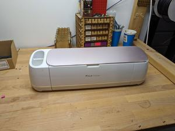
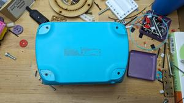
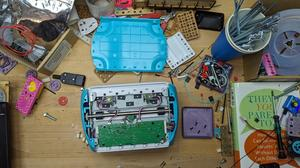
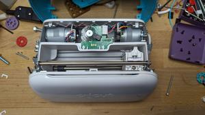
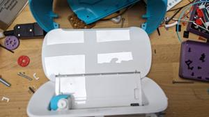
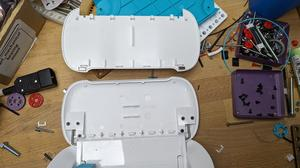
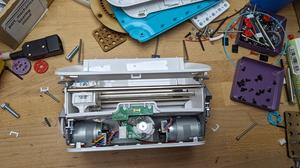
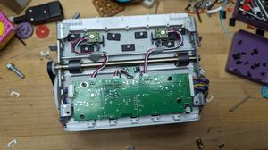
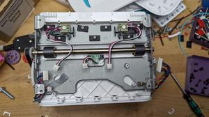
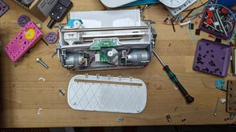

# Oomp Teardown Vinyl Cutter Cricut Joy
Oomp Teardown Vinyl Cutter Cricut Joy

Oomp Teardown Vinyl Cutter Cricut Joy  

## disassembly
### step: 1
  
before starting
### step: 2
  
remove the four screws in the base, bottom comes off easily
### step: 3
  
remove the four screws side screws holding the top plastic piece in place. these are at an angle and are a bit difficult to see, then are a bit difficult to reach
### step: 4
  
remove the top plastic piece. there are a few rather aggresive plastic snaps on top, it feels like there are more screws but there aren't
### step: 5
  
remove the cover on the fold down piece, it is held in place with a number of relatively aggresive plastic snaps, but no screws
### step: 6
  
remove the fold down piece bottom, remove the six screws and it comes off easily
### step: 7
  
remove the 4 ish screws and the front cowling
### step: 8
  
remove the pcb, remove the four screws then unplug the cables.
### step: 9
  
remove the back cover, remove the five (mine only had three) screws and pop the back piece off
### step: 10
  
this is where i stopped

## corel working
 

